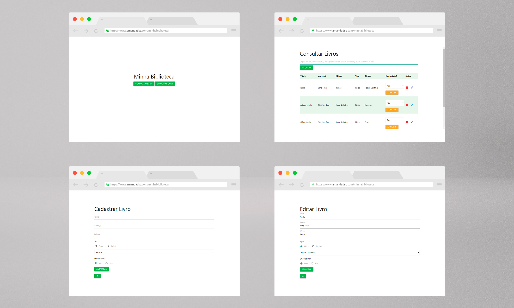

# minhabiblioteca
Sistema para catalogar livros de biblioteca pessoal, podendo editar dados, atualizar se o livro está emprestado ou não e excluir da sua biblioteca.

<a href="http://www.freepik.com">Mockup designed by Cosmo-Studio / Freepik</a>
